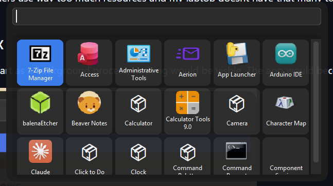

# App-Launcher(Python)
Windows App Launcher with utilities like Calculators accessed by Run Utilities + 1 Easter Egg. Run the App Launcher from start menu and whenever u press Alt+X, It would pop-up.

I made it because existing launchers use way too much resources and my laptop doesnt have that many to give so this runs efficiently and is instant and solves my purpose...




<details>
  <summary>Spoiler</summary>
  The Easter Egg is Puppy Companion(forked from @Giorgiark)
</details>
## [Download Pre Built Binary](https://github.com/SpaceCoderPro/App-Launcher/releases/tag/V1.0)

## Compilation Instructions for .exe
Download all files in the Pyinstaller folder then run the below commands
```
pyinstaller --onefile "Full Calculator Fast.py"                                                       
pyinstaller --onefile "Simple Fast Calculator.py"
pyinstaller --onefile "Simple Int Calculator.py"
pyinstaller --onefile puppy.py
pyinstaller --onefile "App Launcher.pyw"
pyinstaller --onefile index.py
```
## To run with python installed on your computer
Download all files in the root folder then run "App Launcher.pyw"

## Libraries to Install
```
pip install tkinter pynput pywin32
```
